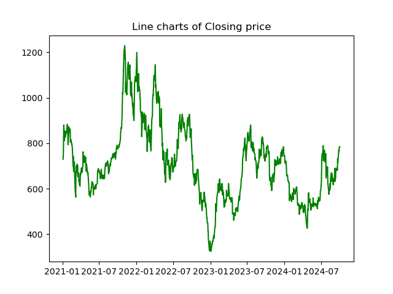

# Enhancing Investment Returns with Machine Learning 

In an era where stock markets are becoming more complicated and elusive, investors are usually overwhelmed by numerous information and data from the market. So, how to minimize risk, boost returns, and even achieve excess gains has become a major focus for investors. We understand that achieving the right balance between security and opportunity is essential in today’s dynamic market environment. That’s why we aim to empower investors through data science techniques, helping them unlock better returns in the stock market. With advanced analytics, we provide insights that make smarter, more profitable decisions possible.

Machine learning (ML), a branch of data science, with its ability to analyze vast datasets and recognize complex patterns, has emerged as a promising tool for understanding and predicting stock market movements. Our mini project explores how ML techniques can improve investment returns by accurately predicting stock price trends, with a particular focus on Tesla as a case study. 

## Understanding Challenges in Stock Market 

Forecasting stock prices is notoriously challenging due to the volatile and dynamic nature of the market. Some challenges will arise when we want to make a prediction, like how to choose the timing, how to find the important indicators, how to obtain possible future information, and how to stay sensible during the decision-making process. Here are some examples of the challenges that can be shown in Tesla in the following picture. 

Stock price patterns can be hard to predict, with significant fluctuations and some periods of sharp ups and downs. Navigating this volatility requires a keen understanding and the right tools to stay ahead.

Trading volume shows the market's activity level and investors' enthusiasm for Tesla. It's clear, however, that any patterns in trading are quite subtle, underscoring how challenging it can be to time stock trades effectively and maintain a steady, rational approach in a volatile market. 

## Aha Moment 

Therefore, we are here, trying to offer a possible solution to solve the above challenges through our project. Traditional methods often fall short when attempting to capture the non-linear patterns inherent in stock prices. So, we are planning to use data science to empower investment stock investment, leveraging ML techniques into stock price prediction, specifically a Long Short-Term Memory (LSTM) model, which is well-suited for time series data. This approach enables investors to better anticipate price fluctuations and refine their investment strategies by providing insights grounded in data.  

## Insights and values - Key Indicators 

Before applying our ML models for prediction, we conducted an exploratory data analysis (EDA) to gain deeper insights into stock-related data and offer valuable perspectives for investors. A key part of this process was using Principal Component Analysis (PCA) to identify major factors impacting stock prices. By pinpointing these key indicators, we empower investors to analyze investment strategies more efficiently and make smarter decisions.  

We conducted correlation tests and the KMO test to examine relationships among the variables, ensuring they're well-suited for PCA. This approach allows us to focus on the most influential factors, delivering more targeted insights for investors.  

The two images above show that our original variables meet the conditions for PCA, allowing us to proceed confidently with the analysis. 

 

In the PCA analysis, we found that among the 11 price, technical, and public interest indicators, there are three main components influencing the closing price: PC1, PC2, and PC3. By analyzing the proportion of each main component represented by the 11 indicators, we can identify the representative indicators for each principal component, as highlighted in the figure below.

 

 

 

So the three key indicators - lowest price, RSI, and public interest - are the most significant contributors to stock price, as shown in the flowchart below.

When analyzing the stock market, investors can prioritize these three key indicators. Doing so significantly optimizes analysis efficiency, enabling faster trading insights and maximizing the marginal gains from investment analysis.  

## Insights and values - Price prediction 

Next, we used an LSTM model to predict stock prices, two methods of the model application can be applied: one using the three key indicators from the PCA results for multi-step forecasting, and the other focusing on the closing price as the primary indicator for self-prediction. After comparing both approaches, we found that the latter significantly outperformed the former. Thus, we've chosen this method as the foundation for our project.  

Our model's application process, shown in the flowchart below, uses data science techniques to improve stock investments with accurate future price predictions. With these insights, investors can adjust their strategies and optimize trade timing, achieving returns that outperform the market.  

With impressive accuracy and reliable predictions for future stock prices, our model offers valuable foresight for investors. We have plotted the original stock price data, model testing results, and predicted stock price data on the same chart below.  

The blue line on the left represents Tesla's closing stock prices from January 4, 2021, to January 17, 2024. 

The overlapping green and red sections show the model's testing results: the green line represents Tesla's actual closing prices from January 18, 2024, to September 30, 2024, while the red dotted line shows our model's predicted prices for the same period based on previous closing price data. As we can see, the two lines are very close, indicating a strong prediction accuracy. 

 
 
The yellow line on the right represents the model's predicted daily closing prices for Tesla from October 1 to October 10, 2024. Investors can use these predictions to plan their investment strategies in advance.

## Our potentials in the future 

Currently, our model can predict stock prices reasonably well for about 10 days into the future. There's no doubt that our project holds tremendous potential for the future, with opportunities to deliver even greater value to investors.  

On one hand, we're planning to make the following improvements to improve accuracy for longer-term predictions:  

 <b>1.  Expand Data Sources</b>: Besides using search trend data from Google Trends, we will add more indicators that reflect public sentiment around a specific stock. For example, we'll gather data from posts on social platforms like X and news from financial websites like Bloomberg. This way, we can better gauge how investors feel about the stock and whether there's a general optimism or caution.  

 <b>2. Apply Financial Analysis Techniques</b>: We'll combine traditional financial analysis methods, like value analysis, with more advanced machine learning techniques to build a more interpretable and accurate stock prediction model.  

On the other hand, we're planning to add several new features to enhance user-friendliness:  

<b>1. Stock Code Input</b>: Users will be able to enter the stock code they want to predict, and the application will automatically generate future price trend predictions.  

<b>2. Custom Indicator Selection</b>: Users can select which indicators to include in the prediction, allowing them to focus on factors they feel are most relevant based on their own investment experience.  

 
